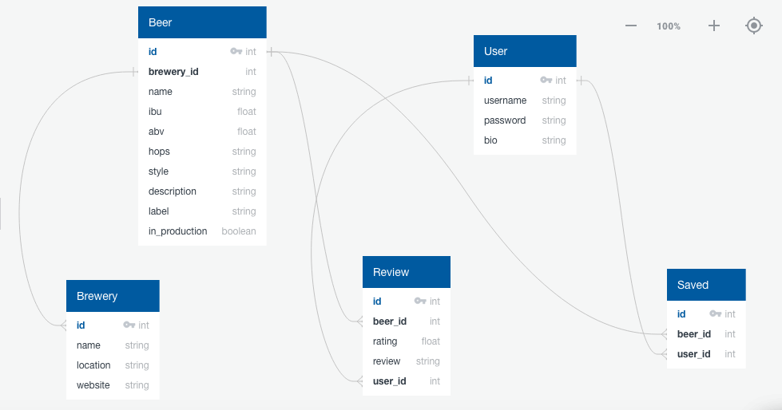

#IPAz Web App (Proposal #1)

**What goal will your website be designed to achieve?**

My goal for the website will be a place where you can discover new IPAs to drink. Ideally a user will be able to sort by ABV, IBU, and Hop Types. Searching for a beer based on those parameters would be accessible to anyone who visits the site. But you can also create an account and login to post reviews and keep track of the IPAs you have tried.

**What kind of users will visit your site? In other words, what is the demographic of
your users?**

My demographic for potential users would be beer drinkers, but mainly beer drinkers who enjoy IPA’s. 

**What data do you plan on using?** 

I will be using the API from untapped (https://untappd.com/api/docs#beersearch). 

**What does your database schema look like?**

This would allow me to have a model and section for essential beers that the user has liked and saves to a “try in the future” section. Then a model and section for the beers that the user has tried and has reviewed. And then a general database full of beers to then sort on the main page based from the parameters the user selects (hops, ibu, abv, maybe style as well).

**What kinds of issues might you run into with your API?**

I think my biggest issue is going to be sorting the description to find the hops. I doubt the majority of the descriptions will have the hops listed, so I may not be able to include that as a sortable parameter.

Also, since there are so many beers, will I need to store all the beers, prior to the site loading, in a database? If not, what will the speed be like for making several API calls to get all of the possible beers down from their site.

**Is there any sensitive information you need to secure?**

I’ll need to store the user’s password securely.

**What functionality will your app include?**

My website will include all CRUD aspects as well as interactive sorting home page that will include checkboxes and sliders to pick parameters. The user will also be able to write and save reviews of beers and save beers they’d like to try in the future. And those beer listings should be able to connect to a page of the brewer showing other IPA’s they may have.

**What will the user flow look like?**

The user can sort and find different types of IPAs from the home page and then if they click the add or review icon of that particular beer, it will prompt the user to login/register. Once logged in, they’ll then be able to “favorite” any of the returned beers to add to their save for later section. They then can sort their save for later section and click to review any of those beers once they have tried them. Which would take them to reviews page. Which would also be sortable. At any point if the user clicked on the brewery name, they would then be taken to the brewery page.
  
**What features make your site more than CRUD? Do you have any stretch goals?**

I think the User Account features are going to be a little more than what I could of just achieved if I stuck to a static homepage of sortable and likeable beer suggestions. I’m not sure how much of the interconnected-ness or sortablitiy i’m going to be able to implement with the time, but that’s the stretch goal.

