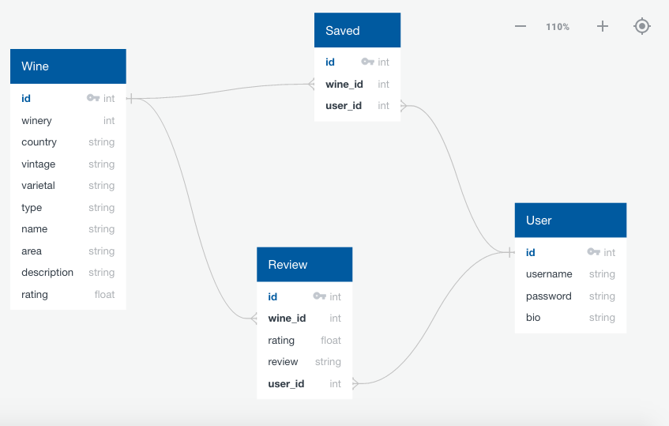

##WINE NOT?

**API**

I will be using the API from Quini Wine (https://quiniwine.com/app/#/toplink?linkname=data). 

**SCHEMA**

**FLOW**

A Landing page where you can access even if you are not logged in. It prompts the user with a question, would you like to try a new wine? and a button to submit. Once the user hit submit, a new page will appear asking to pick a type of wine. 

There will be three buttons, Red, White, Rose. Once a user picks a button another page will then load asking to choose from an even larger list of options. 

These buttons are toggleable and a new page will not load until the user is done selecting the different type of varietals they would like to be returned (Grenache, Pinot Noir, Tempranillo, etc). Once they hit submit, the results will load underneath the selectors, allowing the user to actively toggle the selectors at any given time.

A user will also be able to register/login and favorite wines as well as write reviews for wines. That way, when logged in, theresults will not return wines that the user has already reviewed.