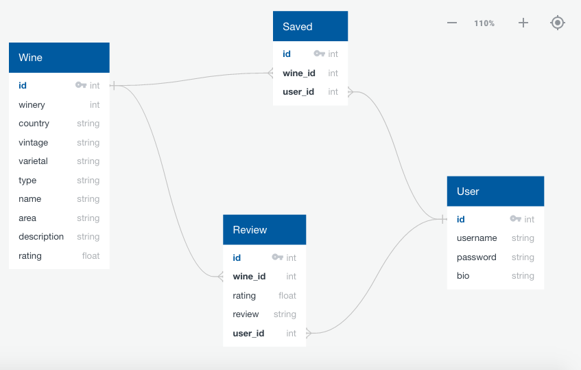

**LINK TO FINISHED APP**

https://wine-not-app.herokuapp.com/

**API**

I used the API from Quini Wine (https://quiniwine.com/app/#/toplink?linkname=data). 

The varietals provided by the API came in a string separated by commas. In order to separate them into an array and filter out as many incorrect names of varietals or typos, I used python's .split function and regex. Those were then appended to arrays based on the wines type. That's how the user can choose from standalone varietals on the landing page.

**SCHEMA**

**FUNCTION OF SITE**

A place where users can go to find inspiration for new wines to try, as well as keep track of the wines they try with reviews and favoriting. 

**FLOW**

There is a Landing page where the user can access and utilize even if they are not logged in. It prompts the user to select a wine type (Red, White, or Rose), utilizing buttons so more than one wine type can be selected. Then a user can select various varietals based on the wine type selected, as well as how they would like to sort the results. Once the user clicks the "Find my wine" button, the results are shown on a new page.

The results page has a side-bar where the user can sort by several different parameters (Wine Type, Wine Style, Rating, Vintage, Winery Alphabetical). Also, a modal will expand if the user would like to add or subtract varietals on the results page. All changes based on those selections are fulfilled using AJAX.

On the wine results lives two buttons. A favorite star and a wine review icon. If not logged-in and clicked, the user receives a flash message to sign-up or log-in in order to complete either objective.

If the user signs-up or logs-in, the navbar changes to accommodate with a Favorites route where the user can see their favorite wines. A Reviews route where they can see their reviewed wines, and a Profile route where then can see how many favorited wines and reviews they have. As well as their most recent favorite wine and top-rated wine.

**IMPLEMENTATION**

HERO IMAGE - I wanted the first thing the user sees, to be a clear and concise message about what the site is all about.

WINE TYPE / VARIETALS / WINE STYLE BUTTONS - In hindsight, it may be a better UX to have a search bar in place of the buttons to select varietals, but I liked the visual rhythm and tactile-ness of the buttons. As well as, the ability to see varietals that you may not know about in case you didn't know where to begin. So, I split the difference and added a search bar to the navbar.

SEARCH BAR - A way for the user to search for a specific wine, or a catch-all like wine type or varietal. Though these results are not sortable, they can still be favorited and reviewed if logged in.

PAGINATION - I implemented pagination out of necessity since it is possible for the user to be shown all wines in the database if they do not select anything prior to hitting the "Find my wine" button. This helped speed up content loading, especially after implementing AJAX.

SORTING - The main challenge of this app that I was excited about was sorting. I wanted a way to efficiently sort database items. It proved more difficult based on various types of sorting that are allowed. I ended up using a combination of SQLalchemy queries and regex for the filters like wine type and wine style. And used javascript functions to sort the results based off of the sort parameters.

**TECHNOLOGY STACK**

* HTML
* CSS
* Bulma
* Javascript
* Python
* Flask
* Jinja
* PostgreSQL
* SQLalchemy
* WTForms
* Axios
* Heroku

**PERFORMANCE**

I was pitted against several performance issues throughout this project. One that stood out and required a complete architecture overhaul was the issue of sorting.

I originally was using jinja templates to populate the wine results to the DOM. Unfortunately, this was proving to be time-consuming and led to a bad UX when trying to sort the wine results since it was leading to continuous backend calls when the DOM needed to be updated. 

Considering that pagination would also be necessary, I switched to a frontend centric model. All wine results would be sent to the frontend and stored as an array in a variable. 

A javascript function would then loop over any necessary sorting functions based on the user's choices. Then a separate function would take those results and separate them into sub-arrays in order to be paginated. This ended up shaving off a significant amount of time in took to display the results.
